<p align="center">
  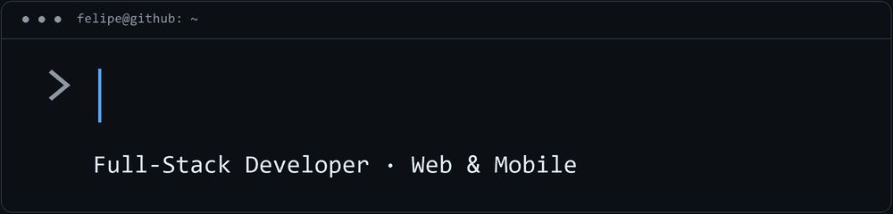
</p>

# Hi, I'm Felipe Medeiros 👋

**Full-Stack Developer · Web & Mobile**

I build web platforms, mobile apps and the APIs that connect them — from accessible interfaces to payments, shipping integrations and automated delivery.

<p>
  <a href="https://felipefmedeiros.com/">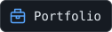</a>
  <a href="https://www.linkedin.com/in/felipe-fmedeiros/"></a>
  <a href="mailto:contato@felipefmedeiros.com">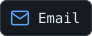</a>
</p>

## 👨‍💻 About me

I'm a Computer Science undergraduate at **UERN**, building products with **React and TypeScript**, **Node.js and Bun**, **C# / .NET**, and **React Native**.

- **Full-stack products:** e-commerce, administrative dashboards and mobile apps published on the App Store and Google Play.
- **Integrations & automation:** payments, shipping, marketplace data and background workers.
- **Performance & delivery:** optimizing APIs and data flows, with Docker and CI/CD on Linux.
- **Research & teaching:** accessibility applications, ERP/marketplace integration and mentoring students in C programming.

<details>
<summary>More about me — in TypeScript</summary>

```typescript
const felipe = {
  name: "Felipe Medeiros",
  role: "Full-Stack Developer",
  education: "Computer Science @ UERN (in progress)",
  builds: ["Web platforms", "Mobile apps", "APIs & integrations"],
  caresAbout: ["Performance", "Accessibility", "User experience"],
  languages: ["Portuguese (native)", "English (B2)"],
};
```

</details>

## 🛠️ Tech stack

**Web & UI**


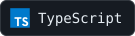
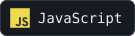
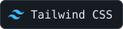
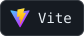
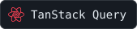
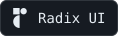
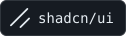

**Mobile**

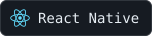


**Back-end & integrations**

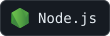

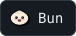
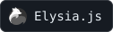
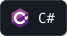


REST APIs · WebSockets · JWT authentication · Payments & shipping APIs

**Databases & ORMs**

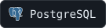
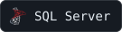

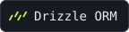
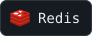

Redis experience comes from personal projects.

**Infrastructure & delivery**

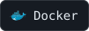
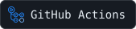
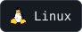
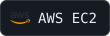

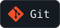

**Design & API tooling**

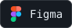
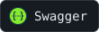


<details>
<summary>Research, fundamentals & additional experience</summary>

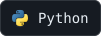
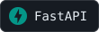

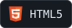
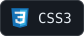
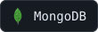
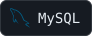

Python/FastAPI are part of my accessibility research; C is part of my academic and teaching experience.

</details>

## 🚀 Selected work

### 🛍️ Ateliê Bruna Pimenta

An e-commerce platform with an accessible component system, catalog management, role-based access and transactional inventory. I integrated **Mercado Pago payments** and **Melhor Envio shipping**, with concurrency and idempotency controls, and built a Docker-based deployment pipeline.

**React · TypeScript · Bun · Elysia.js · Drizzle ORM · PostgreSQL · Docker · Caddy**

[Visit the store ↗](https://ateliebrupimenta.com.br/)

### 🍽️ FocoQuali

A lead acquisition and management platform with a responsive website, REST API and administrative dashboard. My work includes JWT authentication, content and file management, email notifications and audit logs.

**React · TypeScript · Tailwind CSS · Node.js · Express · PostgreSQL · Prisma · Zod**

[Explore FocoQuali ↗](https://focoquali.com/)

### 📱 DNA do Brasil

A web and mobile ecosystem for sports and vocational talent development, supporting **20,000+ registered students**. I built REST endpoints, web interfaces and a React Native app published on the App Store and Google Play, and optimized mobile data transfer.

**React · TypeScript · React Native · Expo · C# / .NET · SQL Server**

[Explore DNA do Brasil ↗](https://dnadobrasil.org.br/)

### ⚙️ Poupou Legal

An offers and coupons platform with search, filtering and administrative tools. Beyond the web platform, I developed a **Bun/TypeScript worker** to collect and categorize offers, integrating the Groq API and distributing them through a Telegram bot.

**React · TypeScript · Node.js · Bun · PostgreSQL · Docker · GitHub Actions**

[Explore Poupou Legal ↗](https://poupoulegal.com.br/)

<details>
<summary>More shipped websites — performance, accessibility & SEO</summary>

### 🛏️ Simmons Colchões Icaraí

A conversion-focused website with static pre-rendering, accessible components and local SEO for the Niterói region.

**React · TypeScript · Tailwind CSS · Bun · Radix UI · SSG**

[Visit Simmons Icaraí ↗](https://simmonsicarai.com.br/)

### 🛏️ Simmons Colchões Itaipava

A responsive website optimized for loading performance, search visibility and lead acquisition.

**React · TypeScript · Tailwind CSS · shadcn/ui · React Compiler**

[Visit Simmons Itaipava ↗](https://simmonsitaipava.com.br/)

### 🏡 Santorini Home Design

A product-focused website for a luxury furniture brand, with an intuitive catalog and a streamlined browsing experience.

**React · TypeScript · Tailwind CSS · React Compiler**

[Visit Santorini ↗](https://santorinihomedesign.com.br/)

</details>

## 🔬 Research & academic projects

- **ERP & marketplace integration — bachelor's thesis in progress:** a proof-of-concept hub using adapters and a shared data model to synchronize inventory, prices and orders with a simulated ERP. Built with TypeScript, Bun, Elysia.js, PostgreSQL and Drizzle ORM.

## 📊 GitHub Stats

<div align="center">
  <a href="https://github.com/FelipeFMedeiros">
    
    
  </a>
</div>

## 🤝 Let's connect

Have a project in mind? I'd love to hear about it.

<p>
  <a href="https://felipefmedeiros.com/"></a>
  <a href="https://www.linkedin.com/in/felipe-fmedeiros/"></a>
  <a href="mailto:contato@felipefmedeiros.com"></a>
  <a href="https://www.instagram.com/felipef.medeiros/"></a>
</p>
