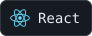
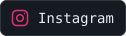

# Generate SVG badges and contact icons

This repository includes a Python generator for local SVG technology badges and contact buttons. The SVGs embed their icons and can be used in any GitHub README.

## Generate the icons

Requirements: Python 3.10 or later and Pillow. Run these commands from the root of project:

```sh
python -m pip install -r scripts/requirements.txt
python scripts/generate_assets.py --badges-only
```

The command generates:

- `assets/badges/*.svg`: technology badges defined in `BADGES`.
- `assets/contacts/*.svg`: Portfolio, LinkedIn, Email and Instagram buttons.

Generation works offline with the included logo files. No API keys or GitHub credentials are required. Running the command again overwrites the generated SVGs with the current labels, icons and colors.

## Customize technology badges

Edit `BADGES` in `scripts/generate_assets.py`. Each entry has this format:

```python
"output-file-name": ("Visible label", "source-icon-name", None),
```

- The dictionary key becomes the filename in `assets/badges/`.
- The label is displayed beside the icon.
- The source icon is loaded from `assets/icons/<source-icon-name>.svg`.
- The optional color recolors a monochrome icon. Use `None` to keep its original colors; black fills are adjusted for readability on the dark background.

For example, add this entry to the existing dictionary to reuse the React logo:

```python
"react-project": ("My React Project", "react", None),
```

Or set a color for a monochrome logo:

```python
"radix-ui": ("Radix UI", "radixui", "#58A6FF"),
```

For a new logo, save a self-contained SVG with a valid `viewBox` in `assets/icons/`, then reference its filename without the extension. Keep any attribution and licensing information with the icon.

Regenerate after making changes:

```sh
python scripts/generate_assets.py --badges-only
```

Removing a dictionary entry does not delete its previously generated file. Remove obsolete SVGs and README references yourself when you no longer need them.

## Customize contact buttons and styling

Contact buttons are defined at the end of `generate_badges()` in `scripts/generate_assets.py`. Portfolio, Email and Instagram use local SVG pictograms; LinkedIn uses its included logo.

Each call to `write_badge()` supplies the destination folder, output filename, visible label and SVG icon:

```python
write_badge(contacts, "instagram", "Instagram", instagram)
```

Edit the label or pictogram to customize a button. The contact URL belongs in the README link, rather than in the SVG.

The shared `SURFACE`, `BORDER` and `TEXT` constants control the badge background, border and label color. Dimensions and typography are defined in `write_badge()`. SVG labels use a monospace font stack and do not require a local font file during generation.

## Restore the included logos

The included technology logos are stored in `assets/icons/`. To download them again from their pinned upstream URLs, run:

```sh
python scripts/download_icons.py
python scripts/generate_assets.py --badges-only
```

Only the download command requires internet access. Its source URLs are listed under `icons` in `assets/icons/sources.json`; repository revisions, attribution and available upstream licenses are stored alongside the logos.

If you add a custom icon and want the download script to restore it too, add its name and a pinned SVG URL to that manifest. Locally drawn contact pictograms are regenerated directly from the generator.

## Use the SVGs in a README

Reference a technology badge with Markdown:

```markdown

```

Wrap a contact button in a link:

```html
<a href="https://www.instagram.com/your-username/">
  
</a>
```

Copy the generated SVGs to your own repository and adjust the relative paths and contact URLs. To regenerate them in another repository, also copy `scripts/` and `assets/icons/`, keeping the same folder structure.

If generation reports a missing icon, check that the source filename matches the second value in its `BADGES` entry. If a logo looks clipped, check its `viewBox` and preview the generated SVG before using it.
